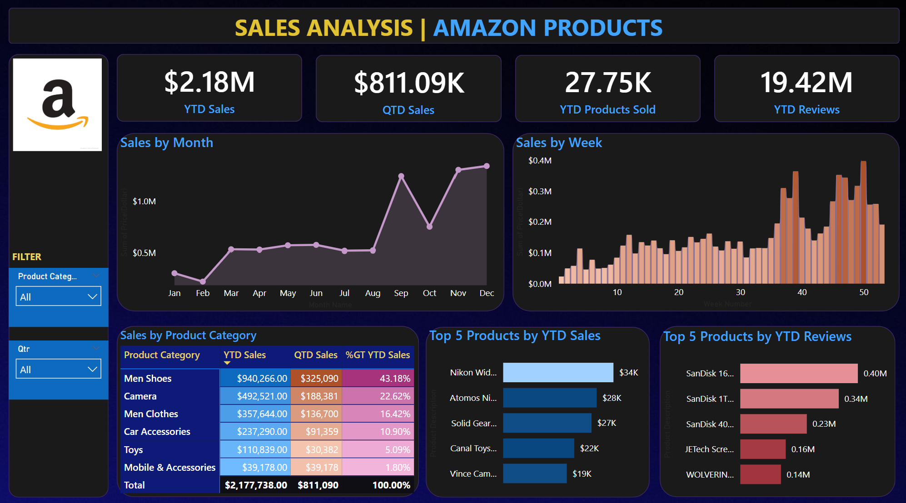

# 📦 Amazon Product Sales Analysis Dashboard

## 📘 Project Overview

The **Amazon Product Sales Analysis** project provides a detailed and interactive view of product sales performance across multiple time dimensions using **Power BI**. This dashboard was created to assist business teams in tracking sales growth, identifying top-performing products, and analyzing customer review patterns for better product strategy and inventory management.

---

## 📊 Dashboard Highlights

### ✅ Key Features

- **Year-to-Date (YTD) and Quarter-to-Date (QTD) Metrics** for tracking sales performance over time
- **Interactive KPIs** for:
  - Total Sales
  - Units Sold
  - Average Customer Ratings / Number of Reviews
- **Visual Components**:
  - Sales trends by **month** and **week**
  - **Category-wise** and **subcategory-wise** performance views
  - **Top 10 products** based on total sales and customer feedback
- **Interactive Slicers**:
  - Category and Subcategory filter
  - Time-based drilldowns (Quarter, Month, Week)

---

## 🖼️ Dashboard Preview

## 🧩 Technologies & Tools Used

| Technology        | Purpose                                  |
|-------------------|-------------------------------------------|
| **Power BI**       | Dashboard development, time intelligence, DAX calculations |
| **DAX (Data Analysis Expressions)** | YTD/QTD measures, KPIs, ranking |
| **Excel/CSV**      | Input data source (simulated Amazon sales data) |
| **Power Query (M)**| Data cleaning and transformation |

---

## 🗂️ Dataset Description

The dashboard uses a simulated dataset resembling Amazon’s product-level sales performance and customer feedback.

| Column Name         | Description                              |
|---------------------|------------------------------------------|
| `Order Date`        | Date of transaction                      |
| `Product Name`      | Name of the sold product                 |
| `Category`          | Product category (e.g., Electronics, Fashion) |
| `Subcategory`       | More specific product type               |
| `Units Sold`        | Quantity sold                            |
| `Total Sales`       | Revenue generated from product sales     |
| `Customer Rating`   | Average rating given by buyers           |
| `Review Count`      | Number of reviews received               |

---

## 📈 Key Measures & Calculations

- **YTD Sales** = Total sales from Jan 1st to selected date
- **QTD Sales** = Total sales from the beginning of the current quarter to selected date
- **Top Products** = Ranked using `RANKX` based on total sales and/or reviews
- **Average Ratings** = Weighted mean of customer reviews by product

---

## 🎯 Use Cases

- 📦 **Product Managers** – to identify high/low-performing products and optimize inventory
- 🛍️ **Category Leads** – to assess performance across product categories and plan marketing
- 📊 **Business Analysts** – to uncover trends and customer behaviors over time
- 💬 **Customer Teams** – to link sales performance with user satisfaction (ratings & reviews)

---

